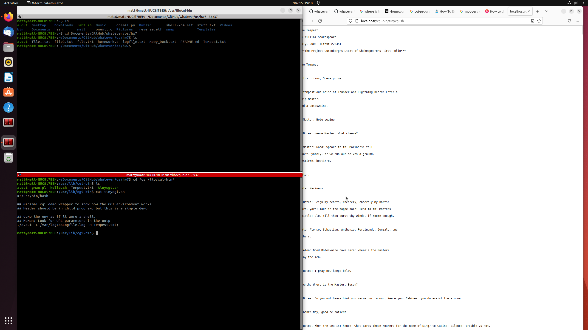

# Operating Systems Homework #7 cgi-bin Programs

Running executable on cgi-bin

## Table of Contents
- Operation[operation]

## Operation

The executable program is all located under ```/usr/lib/cgi-bin```. Under this folder,there is ```a.out``` for the main executable, ```file.txt``` and ```Tempest.txt``` for output file.

The main shell script that runs the executable on to webserver is called ```tinycgi.sh```, this shell script contains the code that is pre-defined for shell to run the executable with certain variables assigned to it.
```
#!/bin/bash

## Minimal cgi demo wrapper to show how the CGI environment works.
## Header should be in child program, but this is a simple demo

## dump the env as if it were a shell.
## Human: Look for URL parameters in the outp

./a.out -rL /var/log/osLogfile.log -H file.txt;

env
```

```
./a.out -rL /var/log/osLogfile.log -H file.txt;
```
This line of code is the one actually running the executable with variable ```-r[everse], -L[ogging], -H[TML]``` while calling ```file.txt``` to read the file onto the webserver.
```
env
```
writes the enviroment variable to the webserver.

## Working Screenshot



## Changed Variables

The folder previlages were changed for logging to properly happen.

All the logging will be saved under
```
/var/log/osLogfile.log
```

In order for logging to correctly occur in root folder, change previlage command was used
```
sudo chown www-data log
```

